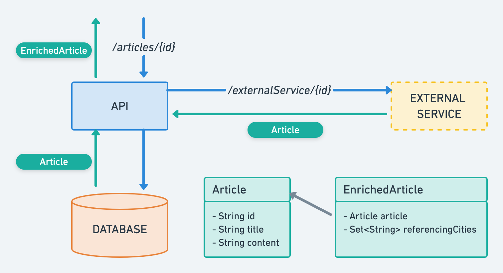

## Backend Developer Test
Build an application that provides RESTful endpoints and follows commonly understood best practices. Third party libraries are acceptable. Please note this should not have a Frontend, so no views or HTML are required.

## Requirements
### Endpoints
The application will provide the endpoint `/articles/{id}` for **GET** method, that will return the `EnrichedArticle` object that corresponds to the given `{id}`, represented as **JSON**.

### Functionality
The application will attempt to get the required `Article` from an External Service, through a **GET** request to the endpoint `/externalService/{id}` (of a given base URL). If the external service does not provide the requested `Article`, then the application will query the internal database to provide it.

Finally, the `Article` object is wrapped within an `EnrichedArticle` object, which is then returned as response.

### HTTP Status Codes and Exception handling
The application must handle the following exceptions:
- *Bad Request*: if the provided `{id}` is `null` or empty
- *Not Found*: if the required `Article` cannot be retrieved from the external service nor from the database
- *Forbidden*: no authorization logic is required, but the application will handle a custom `ForbiddenException` that could be thrown internally
- *Internal Server Error*: the application will handle any other exception returning *Internal Server Error*

### `Article` and `EnrichedArticle`
The `Article` object can be either retrieved from the External Service or from the database, and it consists of three properties of type String, `id`, `title` and `content`.

The `EnrichedArticle` object consists of two properties, `article` of type `Article`, and `referencingCities`, which is a `Set<String>` of cities that are related to the corresponding article.

The `EnrichedArticle` class has a static `Map<String, List<String>>` which relates *cities* to several *article Ids*.

Given an *article Id*, the corresponding `Article` object will be retrieved from the External Service or from the database, then an `EnrichedArticle` object will be created from this `Article` object. The property `referencingCities` of the EnrichedArticle object will consist of a `Set` of the cities that relate to the corresponding *article Id*, **sorted alphabetically**.

### Incremental design
The skeleton classes that conform the RESTful API are provided, and we suggest to follow the below steps:
1. Implement the method `generateReferencingCities()` of the class **EnrichedArticle**, so that it returns a `Set` of the cities that relate to the given *article Id*, **sorted alphabetically**.
2. Implement the configuration to connect to the External Service in class **ApplicationConfig**. Suggest to use [Retrofit](https://square.github.io/retrofit/).
3. Implement the method `getArticle(String id)` of the class **ExternalService**, to return `Optional<Article>`.
4. Implement the method `getEnrichedArticleById(String id)` of the class **ArticleController** to return the `ResponseEntity` with the `EnrichedArticle` containing the `Article` retrieved from the External Service (if successful).
5. Implement the method `getArticleById()` of the class **ArticleService** to retrieve the `Article` object from the database, given its `id`.
6. Add the logic to the method `getEnrichedArticleById(String id)` of the class **ArticleController** to retrieve the `Article` from the database when the request to the external service is not successful.
7. Handle the cases of *Bad Request* (e.g. for a given wrong `id`) and *Not Found*.
8. Add custom exception classes within the package *uk.co.devtest.exception*, and add the corresponding methods in the class **CustomExceptionHandler** to handle these exceptions, returning the appropriate `ResponseEntity` (e.g. with HTTP status code *Internal Server Error*).
9. Modify the method `getEnrichedArticleById(String id)` of the class **ArticleController** to handle the possible exceptions.

**Note**: progress as far as you can following the above steps. It is not a requirement to complete all of them. We will value quality over quantity, so a good solution to part of the expected functionality is better than a poor solution to all the requirements.

### Frameworks, Libraries and recommendations
- This RESTful web service has been built with [Spring Boot](https://spring.io/projects/spring-boot).
- We expect the candidate to follow TDD, including at least the mot significant tests (both unit and integration tests).
- Testing can be done by using *Spring Boot Test Starter*, [JUnit5](https://junit.org/junit5/) /  [JUnit4](https://junit.org/junit4/) + [Hamcrest](http://hamcrest.org/), [Mockito](https://site.mockito.org/), [WireMock](http://wiremock.org/), *MockMvc* / *TestRestTemplate* / [Rest-assured](https://github.com/rest-assured/rest-assured), or any other frameworks/libraries.
- As HTTP client to connect to the *External Service* you can use Spring's *RestTemplate*, [Retrofit](https://square.github.io/retrofit/), [Unirest](http://unirest.io/) or similar libraries.
- For database requests, we suggest to implement the service **ArticleService** based on the provided *CrudRepository* **ArticleRepository**, but you are free to use [JDBI](http://jdbi.org/), [JDBC](https://docs.oracle.com/javase/tutorial/jdbc/basics/index.html) or any ORM or library.

##
Some ideas of what we are looking for are:
- Well thought out software design.
- Testing.
- Clean code.
##
